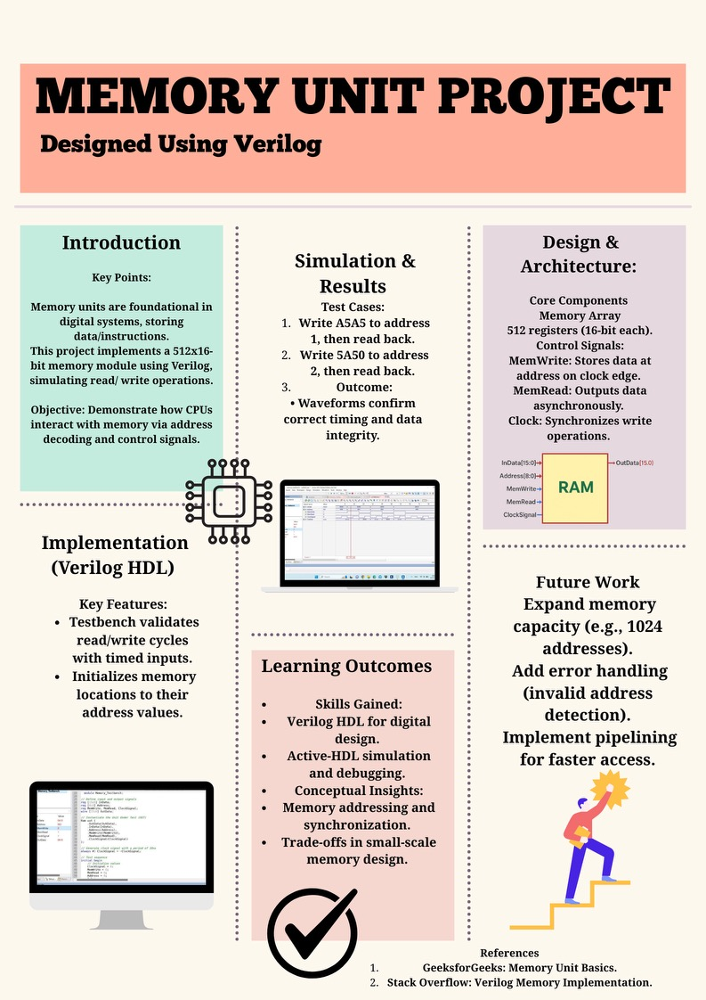

🧠 Memory Unit (Verilog)

A simple Memory Unit designed using Verilog HDL as part of a Digital Design course project.  
The system demonstrates basic memory read/write operations with simulation using a testbench.

---

📌 Description

This project implements a 512 x 16-bit memory unit with read and write functionality controlled by a clock signal.  
A testbench is used to simulate and verify correct behavior of the memory operations.

---

🖼️ Project Poster

---

🛠️ Tools Used

- Verilog HDL
- ModelSim / Vivado (or any HDL simulator)
- Digital Design (Computer Architecture concepts)
